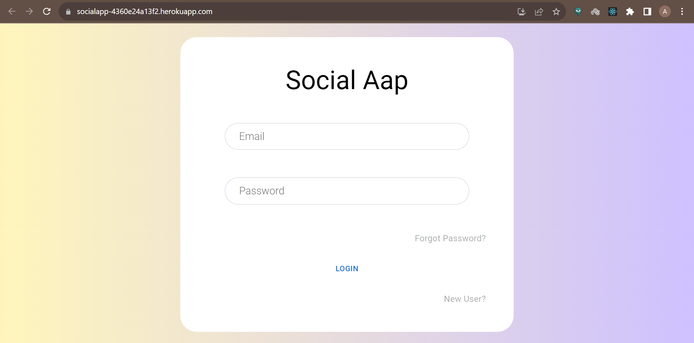

# SocialMedia
 
 Backend (Node.js and Express.js):
- Develop a RESTful API for handling social media data, including posts, comments,
and user profiles.
- Implement user authentication and authorization.
- Utilise MongoDB as the database to store social media content.
  
Frontend (React.js):
- Design a user-friendly dashboard interface for managing social media content.
- Display a real-time feed of social media posts and allow users to interact with them
(like, comment, share).
- Implement user registration and login functionalities.
  
 ### 🔗 Hosted link: [Social Media](https://socialapp-4360e24a13f2.herokuapp.com/)




## 🧑‍💻 Getting started

- Install all required packages

```bash
npm install
```
- Run backend
```bash
npm run dev
```

- cd /frontend

```bash
npm install
```
- Run frontend
```bash
npm start
```

The project is running on the port number provided by you.

## 🛠️ Tools Used

- NodeJS
- ReactJs
- MongoDB
- ExpressJS
- Bootstrap


